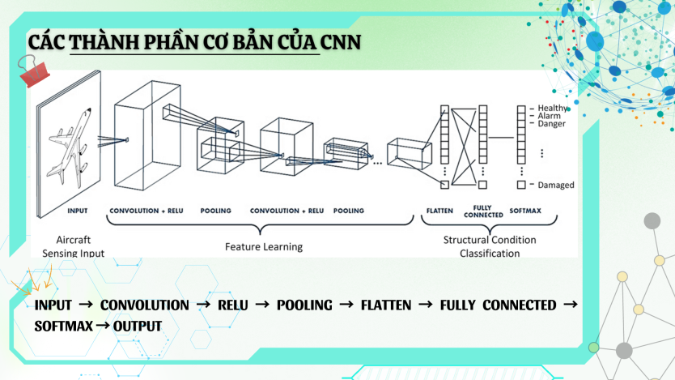
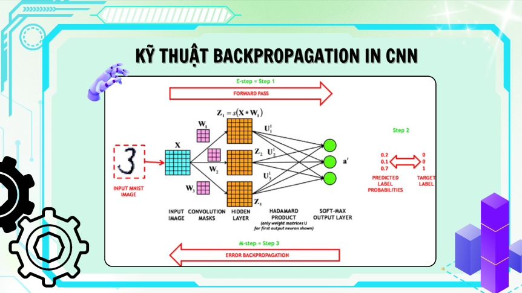
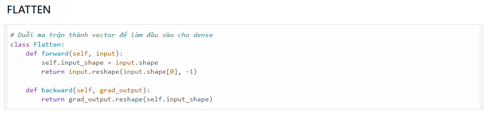
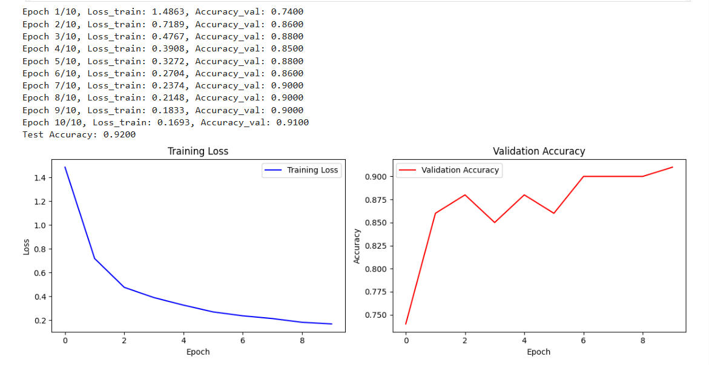
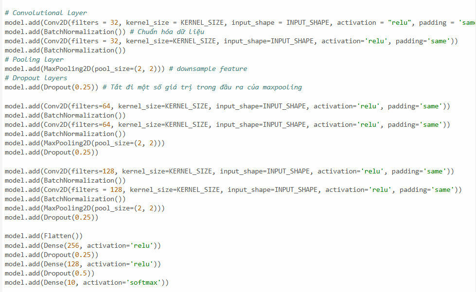
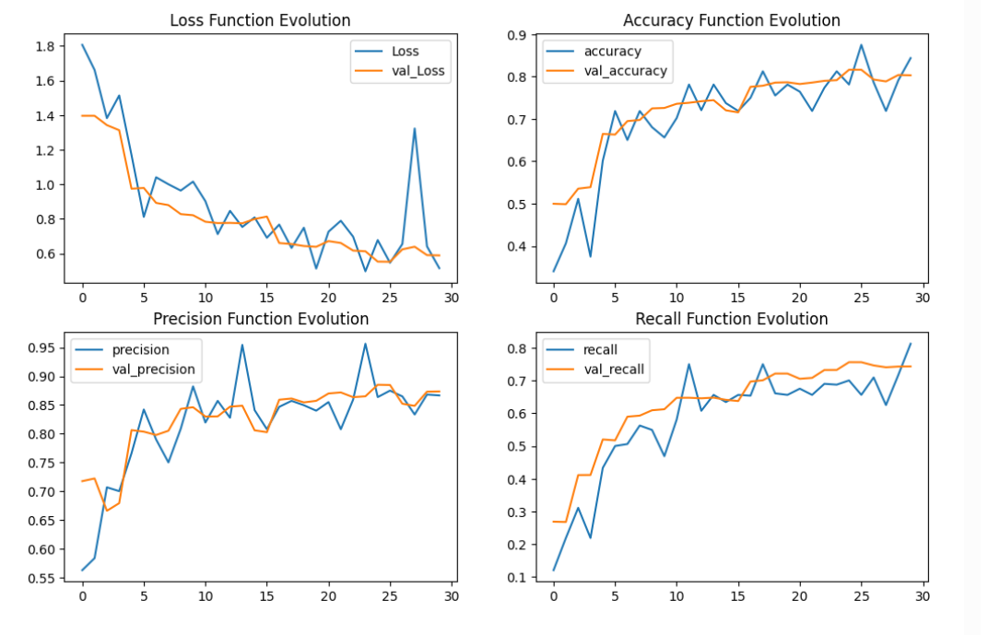

# 📚 Convolutional Neural Network và Backpropagation

## 1. Thông tin tổng quan
- **Convolutional Neural Network (CNN)** là một loại mạng nơ-ron nhân tạo, được thiết kế đặc biệt để xử lý dữ liệu có cấu trúc như **hình ảnh** hay **chuỗi thời gian**.
- Ứng dụng rộng rãi trong các lĩnh vực như **nhận diện hình ảnh**, **thị giác máy tính**, **xử lý ngôn ngữ tự nhiên**,...
- **Backpropagation** là kỹ thuật lan truyền ngược được sử dụng trong CNN để **tối ưu trọng số**, giúp mô hình học hiệu quả hơn.

## 2. Nghiên cứu mô hình
- Phân tích cấu trúc của CNN ứng dụng trong xử lý hình ảnh, giúp **trích xuất đặc trưng ảnh** và **giảm số lượng tham số**.
- Giải thích từng lớp của CNN: `Conv`, `ReLU`, `Pooling`, `Flatten`, `Fully Connected`, `Softmax`...



- **Backpropagation trong CNN**:
  - Lan truyền tiến từ đầu vào đến đầu ra.
  - Tính toán `loss`.
  - Lan truyền ngược từ đầu ra → đầu vào dựa trên đạo hàm hàm mất mát (`Categorical Cross-Entropy`).



## 3. Thực nghiệm

### 3.1. MNIST
- Sử dụng thư viện **NumPy** (không dùng framework cao cấp).
- Xây dựng các lớp CNN từ đầu: `Conv`, `ReLU`, `Pooling`, `Flatten`, `FC`, `Softmax`.


- Huấn luyện trên tập **MNIST** (chữ viết tay 0–9).
- Độ chính xác đạt **92%**.


### 3.2. CIFAR-10
- Sử dụng **TensorFlow** để xây dựng CNN với cấu trúc nâng cao.

- Huấn luyện trên tập dữ liệu **CIFAR-10**.
- Độ chính xác đạt **hơn 80%**.


## 4. Chú thích
- Mọi thắc mắc về **cấu trúc mạng CNN** và kỹ thuật **Backpropagation** có thể tham khảo bản PDF kèm theo.
- Code được thực hiện trên **hai file notebook `.ipynb`**:
  - `cnn_mnist.ipynb` – cho MNIST sử dụng NumPy
  - `cnn_cifar.ipynb` – cho CIFAR sử dụng TensorFlow
    
---

## 🚀 Hướng dẫn sử dụng
Clone repo:
```bash
git clone https://github.com/KL0224/Backpropagation_CNN.git
